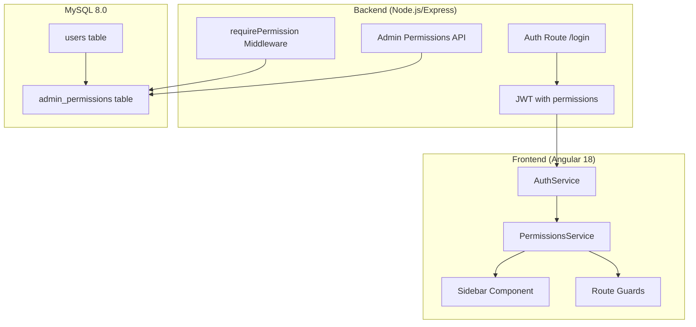
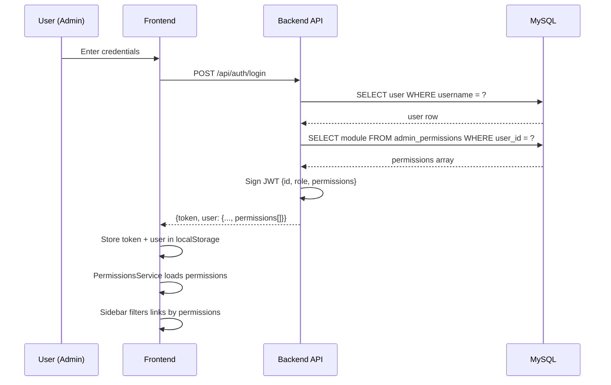
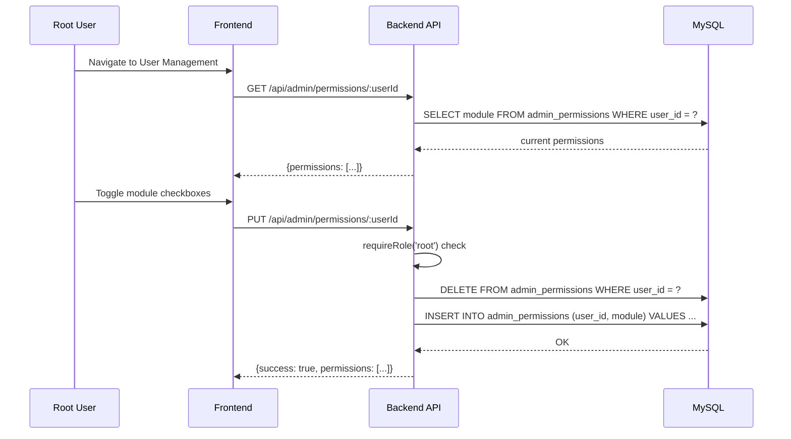
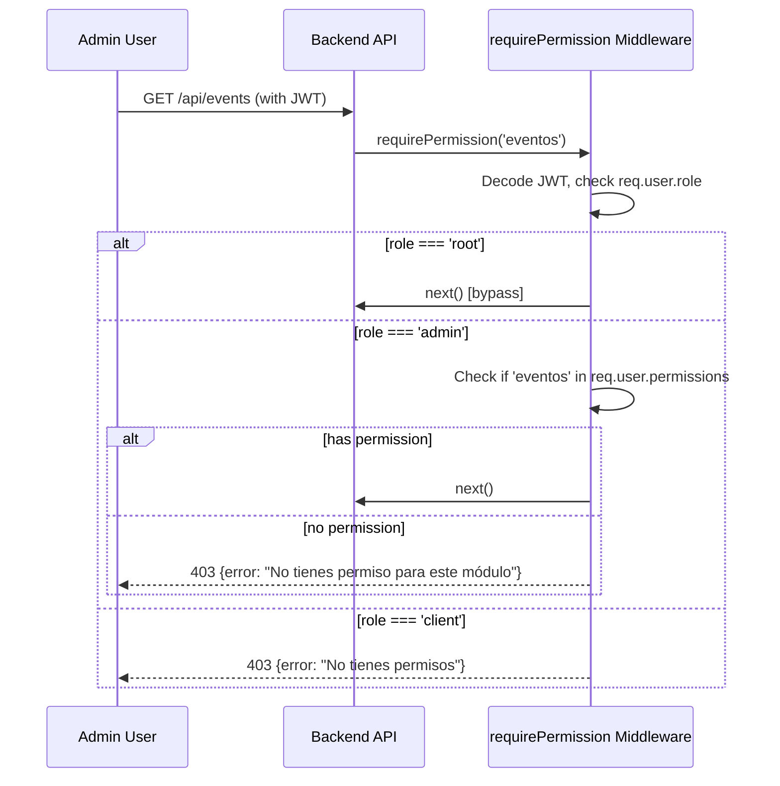

# Design Document: Admin Permissions

## Overview

This feature introduces granular, module-level permission management for admin users. Currently, the system has three roles (`root`, `admin`, `client`) where all admins have identical access to every admin module. The goal is to allow the `root` user to assign specific module permissions to each `admin` user, so that admins only see and can access the modules they've been granted. Root always bypasses permission checks and retains full access.

The system manages 10 distinct modules: Eventos, Invitados, Configuración, Tarjetas, Usuarios, Sugerencias, Compras, Métricas, Eventos Expirados, and Paquetes Admin. Permissions are stored in a dedicated MySQL table, included in the JWT payload at login, and enforced both on the backend (middleware) and frontend (sidebar filtering + route guards).

## Architecture



## Sequence Diagrams

### Login Flow with Permissions



### Root Assigns Permissions to Admin



### Permission-Protected Route Access



## Components and Interfaces

### Component 1: Database Schema (admin_permissions table)

**Purpose**: Store per-admin module permissions in a normalized table.

**Schema**:
```sql
CREATE TABLE admin_permissions (
  id INT AUTO_INCREMENT PRIMARY KEY,
  user_id INT NOT NULL,
  module ENUM(
    'eventos',
    'invitados',
    'configuracion',
    'tarjetas',
    'usuarios',
    'sugerencias',
    'compras',
    'metricas',
    'eventos_expirados',
    'paquetes_admin'
  ) NOT NULL,
  created_at DATETIME DEFAULT CURRENT_TIMESTAMP,
  UNIQUE KEY unique_user_module (user_id, module),
  FOREIGN KEY (user_id) REFERENCES users(id) ON DELETE CASCADE
) ENGINE=InnoDB DEFAULT CHARSET=utf8mb4;
```

**Design Rationale**: 
- One row per user-module pair allows simple INSERT/DELETE for granular control
- ENUM type prevents invalid module names at the database level
- UNIQUE constraint prevents duplicate assignments
- CASCADE delete cleans up when a user is removed

### Component 2: Backend Middleware (requirePermission)

**Purpose**: Enforce module-level access on protected routes.

**Interface**:
```javascript
// middleware/permissions.js
function requirePermission(...modules) {
  return (req, res, next) => { /* ... */ }
}
```

**Responsibilities**:
- Allow root users to bypass all permission checks
- Verify admin users have at least one of the required modules in their JWT permissions
- Return 403 with descriptive error if access denied
- Work alongside existing `requireRole` middleware (applied after auth + role check)

### Component 3: Admin Permissions API

**Purpose**: CRUD endpoints for root to manage admin permissions.

**Interface**:
```javascript
// Routes: /api/admin/permissions
GET    /api/admin/permissions/:userId    // Get user's permissions
PUT    /api/admin/permissions/:userId    // Set user's permissions (replace all)
```

**Responsibilities**:
- Only accessible by root users
- GET returns current module permissions array for a user
- PUT accepts full permission array and replaces existing (idempotent)
- Validates that target user exists and has role 'admin'

### Component 4: Frontend PermissionsService

**Purpose**: Centralized service to check permissions from the stored user object.

**Interface**:
```typescript
// services/permissions.service.ts
@Injectable({ providedIn: 'root' })
export class PermissionsService {
  hasPermission(module: AdminModule): boolean;
  hasAnyPermission(...modules: AdminModule[]): boolean;
  getPermissions(): AdminModule[];
  isRoot(): boolean;
}
```

**Responsibilities**:
- Read permissions from AuthService user data
- Provide reactive permission checking
- Root always returns true for all permission checks
- Used by sidebar component and route guards

### Component 5: Frontend Permission Guard

**Purpose**: Angular route guard preventing navigation to unauthorized modules.

**Interface**:
```typescript
// guards/permission.guard.ts
export function permissionGuard(module: AdminModule): CanActivateFn;
```

**Responsibilities**:
- Prevent client-side navigation to modules without permission
- Redirect unauthorized users to dashboard home
- Root bypasses all checks

## Data Models

### AdminModule Type

```typescript
type AdminModule =
  | 'eventos'
  | 'invitados'
  | 'configuracion'
  | 'tarjetas'
  | 'usuarios'
  | 'sugerencias'
  | 'compras'
  | 'metricas'
  | 'eventos_expirados'
  | 'paquetes_admin';
```

### JWT Payload (extended)

```typescript
interface JwtPayload {
  id: number;
  username: string;
  role: 'root' | 'admin' | 'client';
  can_manage_users: number;
  permissions: AdminModule[];  // NEW: module permissions for admins
}
```

**Validation Rules**:
- `permissions` is empty array `[]` for root (root bypasses checks regardless)
- `permissions` is empty array `[]` for client (clients don't use module permissions)
- `permissions` contains only valid AdminModule values for admin users

### User Response (extended)

```typescript
interface UserResponse {
  id: number;
  username: string;
  role: 'root' | 'admin' | 'client';
  can_manage_users: number;
  must_change_password: boolean;
  permissions: AdminModule[];  // NEW
}
```

### Permission Update Request

```typescript
interface PermissionUpdateRequest {
  permissions: AdminModule[];
}
```

**Validation Rules**:
- `permissions` must be an array
- Each element must be a valid AdminModule value
- Duplicates are ignored (deduplicated server-side)
- Empty array means no permissions (admin sees nothing)

## Key Functions with Formal Specifications

### Function 1: requirePermission (Backend Middleware)

```javascript
function requirePermission(...modules) {
  return (req, res, next) => {
    if (!req.user) return res.status(401).json({ error: 'No autenticado' });
    
    // Root bypasses all permission checks
    if (req.user.role === 'root') return next();
    
    // Only admin role uses module permissions
    if (req.user.role !== 'admin') {
      return res.status(403).json({ error: 'No tienes permisos para esta acción' });
    }
    
    // Check if user has at least one of the required modules
    const userPermissions = req.user.permissions || [];
    const hasAccess = modules.some(m => userPermissions.includes(m));
    
    if (!hasAccess) {
      return res.status(403).json({ error: 'No tienes permiso para este módulo' });
    }
    
    next();
  };
}
```

**Preconditions:**
- `req.user` is populated by auth middleware (JWT decoded)
- `modules` is a non-empty array of valid AdminModule strings

**Postconditions:**
- If `req.user.role === 'root'`: always calls `next()`
- If `req.user.role === 'admin'` AND has at least one matching module: calls `next()`
- If `req.user.role === 'admin'` AND has no matching module: returns 403
- If `req.user.role === 'client'`: returns 403
- If `req.user` is null: returns 401

### Function 2: loadPermissionsForUser (Backend Helper)

```javascript
async function loadPermissionsForUser(userId) {
  const { getDB } = require('../models/database');
  const [rows] = await getDB().query(
    'SELECT module FROM admin_permissions WHERE user_id = ?',
    [userId]
  );
  return rows.map(r => r.module);
}
```

**Preconditions:**
- `userId` is a valid integer referencing an existing user
- Database connection is available

**Postconditions:**
- Returns an array of AdminModule strings (may be empty)
- Array contains no duplicates (enforced by UNIQUE constraint)
- Only contains valid ENUM values

### Function 3: updatePermissions (Backend Route Handler)

```javascript
async function updatePermissions(req, res) {
  const { userId } = req.params;
  const { permissions } = req.body;
  
  // Validate target user exists and is admin
  const [users] = await getDB().query(
    'SELECT id, role FROM users WHERE id = ?', [userId]
  );
  if (!users.length) return res.status(404).json({ error: 'Usuario no encontrado' });
  if (users[0].role !== 'admin') {
    return res.status(400).json({ error: 'Solo se pueden asignar permisos a usuarios admin' });
  }
  
  // Replace all permissions (transactional)
  const conn = await getDB().getConnection();
  try {
    await conn.beginTransaction();
    await conn.query('DELETE FROM admin_permissions WHERE user_id = ?', [userId]);
    
    if (permissions.length > 0) {
      const values = permissions.map(m => [userId, m]);
      await conn.query(
        'INSERT INTO admin_permissions (user_id, module) VALUES ?', [values]
      );
    }
    
    await conn.commit();
    res.json({ success: true, permissions });
  } catch (err) {
    await conn.rollback();
    res.status(500).json({ error: err.message });
  } finally {
    conn.release();
  }
}
```

**Preconditions:**
- `req.user.role === 'root'` (enforced by requireRole middleware)
- `userId` param is a valid integer
- `permissions` is an array of valid AdminModule strings

**Postconditions:**
- All previous permissions for the user are removed
- New permissions are inserted atomically (transaction)
- If transaction fails, no permissions are changed (rollback)
- Response contains the updated permissions array

### Function 4: hasPermission (Frontend Service)

```typescript
hasPermission(module: AdminModule): boolean {
  const user = this.authService.getUser();
  if (!user) return false;
  if (user.role === 'root') return true;
  if (user.role !== 'admin') return false;
  return (user.permissions || []).includes(module);
}
```

**Preconditions:**
- User data is available in localStorage (user is logged in)

**Postconditions:**
- Returns `true` if user is root (always)
- Returns `true` if user is admin AND has the specified module in permissions
- Returns `false` otherwise (no user, client role, or missing permission)

## Algorithmic Pseudocode

### Login with Permissions Algorithm

```pascal
ALGORITHM loginWithPermissions(username, password)
INPUT: username: String, password: String
OUTPUT: {token: JWT, user: UserResponse} or Error

BEGIN
  user ← database.findUser(username)
  
  IF user IS NULL OR NOT bcrypt.compare(password, user.password_hash) THEN
    RETURN Error(401, "Credenciales incorrectas")
  END IF
  
  permissions ← []
  
  IF user.role = 'admin' THEN
    rows ← database.query("SELECT module FROM admin_permissions WHERE user_id = ?", [user.id])
    permissions ← rows.map(r => r.module)
  END IF
  
  payload ← {
    id: user.id,
    username: user.username,
    role: user.role,
    can_manage_users: user.can_manage_users,
    permissions: permissions
  }
  
  token ← jwt.sign(payload, JWT_SECRET, {expiresIn: JWT_EXPIRES_IN})
  
  RETURN {
    token: token,
    user: {
      id: user.id,
      username: user.username,
      role: user.role,
      can_manage_users: user.can_manage_users,
      must_change_password: user.must_change_password,
      permissions: permissions
    }
  }
END
```

### Sidebar Filtering Algorithm

```pascal
ALGORITHM filterSidebarLinks(allLinks, user)
INPUT: allLinks: SidebarLink[], user: UserResponse
OUTPUT: visibleLinks: SidebarLink[]

BEGIN
  visibleLinks ← []
  
  FOR EACH link IN allLinks DO
    IF link.requiredPermission IS NULL THEN
      // No permission required (e.g., Dashboard home)
      visibleLinks.add(link)
    ELSE IF user.role = 'root' THEN
      // Root sees everything
      visibleLinks.add(link)
    ELSE IF user.role = 'admin' THEN
      IF link.requiredPermission IN user.permissions THEN
        visibleLinks.add(link)
      END IF
    END IF
  END FOR
  
  RETURN visibleLinks
END
```

**Loop Invariant**: All links processed before the current index have been correctly classified as visible or hidden based on user permissions.

### Permission Update Algorithm

```pascal
ALGORITHM updateAdminPermissions(rootUser, targetUserId, newPermissions)
INPUT: rootUser: User, targetUserId: Int, newPermissions: AdminModule[]
OUTPUT: Success or Error

BEGIN
  ASSERT rootUser.role = 'root'
  
  targetUser ← database.findUser(targetUserId)
  
  IF targetUser IS NULL THEN
    RETURN Error(404, "Usuario no encontrado")
  END IF
  
  IF targetUser.role ≠ 'admin' THEN
    RETURN Error(400, "Solo se pueden asignar permisos a usuarios admin")
  END IF
  
  deduplicated ← UNIQUE(newPermissions)
  
  BEGIN TRANSACTION
    database.execute("DELETE FROM admin_permissions WHERE user_id = ?", [targetUserId])
    
    FOR EACH module IN deduplicated DO
      database.execute(
        "INSERT INTO admin_permissions (user_id, module) VALUES (?, ?)",
        [targetUserId, module]
      )
    END FOR
  COMMIT TRANSACTION
  
  RETURN Success(deduplicated)
END
```

**Preconditions:**
- rootUser is authenticated and has role 'root'
- newPermissions contains only valid AdminModule values

**Postconditions:**
- Target user's permissions are exactly `deduplicated` (no more, no less)
- Operation is atomic (all-or-nothing)

## Example Usage

### Backend: Protecting a route with permission middleware

```javascript
const { requireRole } = require('../middleware/roles');
const { requirePermission } = require('../middleware/permissions');
const auth = require('../middleware/auth');

// Events route - requires 'eventos' permission for admins
router.get('/events', auth, requireRole('root', 'admin'), requirePermission('eventos'), async (req, res) => {
  // Only root or admins with 'eventos' permission reach here
  const [events] = await getDB().query('SELECT * FROM events');
  res.json(events);
});

// Admin purchases - requires 'compras' permission
router.get('/admin/purchases', auth, requireRole('root', 'admin'), requirePermission('compras'), async (req, res) => {
  // ...
});
```

### Frontend: Sidebar with permission filtering

```typescript
// In dashboard.component.ts
private permissions = inject(PermissionsService);

get adminLinks() {
  return [
    { path: '/dashboard/events', label: 'Eventos', icon: 'event', permission: 'eventos' as AdminModule },
    { path: '/dashboard/admin/compras', label: 'Compras', icon: 'receipt_long', permission: 'compras' as AdminModule },
    { path: '/dashboard/admin/metricas', label: 'Métricas', icon: 'analytics', permission: 'metricas' as AdminModule },
    // ...
  ].filter(link => this.permissions.hasPermission(link.permission));
}
```

### Frontend: Route guard usage

```typescript
// app.routes.ts
{
  path: 'admin/compras',
  loadComponent: () => import('./dashboard/pages/admin/purchases-admin/purchases-admin.component').then(m => m.PurchasesAdminComponent),
  canActivate: [() => permissionGuard('compras')]
}
```

### Root managing admin permissions (API call)

```typescript
// In users management component
async savePermissions(userId: number, permissions: AdminModule[]) {
  await this.http.put(`${environment.apiUrl}/admin/permissions/${userId}`, { permissions }).toPromise();
}
```

## Correctness Properties

*A property is a characteristic or behavior that should hold true across all valid executions of a system — essentially, a formal statement about what the system should do. Properties serve as the bridge between human-readable specifications and machine-verifiable correctness guarantees.*

### Property 1: Root Bypass

*For any* module ∈ AdminModule and *for any* permissions array content, when the user role is 'root', the permission check SHALL return "access granted" regardless of whether the module appears in the permissions array.

**Validates: Requirements 1.1, 1.2, 1.3, 7.1**

### Property 2: Admin Enforcement

*For any* admin user with permissions set P and *for any* module M ∈ AdminModule, the permission check SHALL return "access granted" if and only if M ∈ P. Equivalently, if M ∉ P the check SHALL deny access.

**Validates: Requirements 2.1, 2.2, 2.3, 2.4, 7.2**

### Property 3: Client Isolation

*For any* user with role === 'client' and *for any* module ∈ AdminModule, the permission check SHALL always deny access with HTTP 403.

**Validates: Requirements 3.1, 3.3**

### Property 4: Permission Update Round-Trip

*For any* valid permissions array P (containing only valid AdminModule values, deduplicated), after a successful PUT /api/admin/permissions/:userId with P, a subsequent GET /api/admin/permissions/:userId SHALL return a set equal to P.

**Validates: Requirements 4.1, 4.2, 5.3**

### Property 5: Deduplication Idempotence

*For any* permissions array P that may contain duplicate values, updating with P SHALL produce the same database state as updating with the deduplicated version of P.

**Validates: Requirements 4.6**

### Property 6: No Privilege Escalation

*For any* user with role !== 'root', requests to PUT /api/admin/permissions/:userId SHALL be rejected with HTTP 403, preventing non-root users from modifying permissions.

**Validates: Requirements 4.3**

### Property 7: Atomicity on Failure

*For any* initial permissions state S and *for any* update operation that fails mid-transaction, the database permissions state SHALL remain exactly S after the failed operation.

**Validates: Requirements 5.1, 5.2**

### Property 8: JWT-DB Consistency at Login

*For any* admin user with permissions set P stored in the database, upon successful login the JWT permissions field SHALL contain exactly the set P.

**Validates: Requirements 6.1, 6.4**

### Property 9: Invalid Input Rejection

*For any* string not in the AdminModule ENUM included in a permissions update request, the System SHALL reject the request with HTTP 400. *For any* non-array value provided as the permissions field, the System SHALL reject the request with HTTP 400.

**Validates: Requirements 9.1, 9.2**

## Error Handling

### Error Scenario 1: Admin Accesses Unauthorized Module

**Condition**: Admin user without the required module permission hits a protected endpoint
**Response**: HTTP 403 `{ error: "No tienes permiso para este módulo" }`
**Recovery**: Admin must request permission from root; frontend prevents navigation proactively via route guard

### Error Scenario 2: Root Assigns Permission to Non-Admin

**Condition**: PUT request targets a user with role 'client' or 'root'
**Response**: HTTP 400 `{ error: "Solo se pueden asignar permisos a usuarios admin" }`
**Recovery**: Root selects a valid admin user

### Error Scenario 3: Invalid Module in Permission Update

**Condition**: Request body contains a module name not in the ENUM list
**Response**: HTTP 400 with validation error (caught by express-validator or MySQL constraint)
**Recovery**: Frontend UI uses checkboxes with fixed module list, preventing invalid input

### Error Scenario 4: Database Transaction Failure

**Condition**: INSERT fails after DELETE during permission update
**Response**: Transaction rollback, HTTP 500 `{ error: "..." }`
**Recovery**: Original permissions remain intact; root can retry the operation

### Error Scenario 5: Stale JWT After Permission Change

**Condition**: Admin's permissions are updated but their current JWT still has old permissions
**Response**: Backend uses JWT permissions (potentially stale until re-login)
**Recovery**: Force re-login on permission change or implement token refresh. Initial implementation: admin must re-login. Future enhancement: WebSocket notification or short-lived tokens.

## Testing Strategy

### Unit Testing Approach

- **requirePermission middleware**: Test with mocked req/res for all role combinations (root bypass, admin with/without permission, client rejection)
- **PermissionsService**: Test `hasPermission()` logic for root, admin, client, and null user scenarios
- **Permission guard**: Test route activation/rejection based on permissions
- **Validation**: Test that invalid module names are rejected

### Property-Based Testing Approach

**Property Test Library**: fast-check

Key properties to test:
1. Root always passes any permission check regardless of modules array content
2. Admin with module X in permissions always passes check for module X
3. Admin without module X in permissions never passes check for module X
4. Permission update followed by read returns exactly the same array (set equality)
5. Deduplication: updating with [A, A, B] produces same result as [A, B]

### Integration Testing Approach

- Full login flow: verify JWT contains correct permissions after login
- Permission CRUD: create admin, assign permissions, verify access, revoke, verify denial
- Cascade: delete user, verify admin_permissions rows are gone
- Concurrent updates: two rapid permission updates don't leave inconsistent state

## Security Considerations

- **JWT Size**: With 10 modules max, permissions array adds minimal bytes to JWT. If modules grow significantly, consider storing permissions server-side with a cache lookup instead of in the token.
- **No Self-Elevation**: Middleware must ensure admin users cannot call the permissions API for themselves or others. Only root role can access `/api/admin/permissions`.
- **Token Staleness**: After permission revocation, the admin's existing JWT still grants access until expiry. Acceptable for MVP given short token lifetime. Consider implementing a token blacklist or version counter for stricter requirements.
- **Input Validation**: Server-side validation of module names against the ENUM. Never trust frontend-only validation.
- **SQL Injection**: All queries use parameterized statements (mysql2 prepared statements).

## Performance Considerations

- **Single Extra Query at Login**: Loading permissions adds one SELECT query during login (indexed by user_id). Negligible impact.
- **No Runtime DB Lookups**: Permission checks use JWT payload data — zero database queries per request for authorization.
- **Small Table**: With ~10 modules × number of admins, the `admin_permissions` table will remain tiny.
- **Index**: The UNIQUE KEY on (user_id, module) serves as the primary lookup index.

## Dependencies

- **Existing**: mysql2, jsonwebtoken, bcryptjs, express, @angular/core, @angular/router
- **No new dependencies required**: The feature uses existing patterns (middleware, JWT, Angular services/guards) without introducing new libraries.

## Module-to-Route Mapping

| Module | Backend Routes | Frontend Route |
|--------|---------------|----------------|
| eventos | /api/events | /dashboard/events |
| invitados | /api/guests | /dashboard/guests/:eventId |
| configuracion | /api/config | /dashboard/config/:eventId |
| tarjetas | /api/cards | /dashboard/cards/:eventId |
| usuarios | /api/users | /dashboard/users |
| sugerencias | /api/suggestions | /dashboard/suggestions |
| compras | /api/admin/purchases | /dashboard/admin/compras |
| metricas | /api/admin (metrics) | /dashboard/admin/metricas |
| eventos_expirados | /api/admin/events | /dashboard/admin/eventos-expirados |
| paquetes_admin | /api/admin/plans | /dashboard/admin/paquetes |
