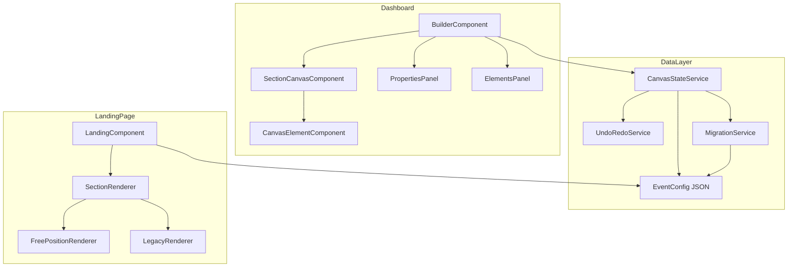
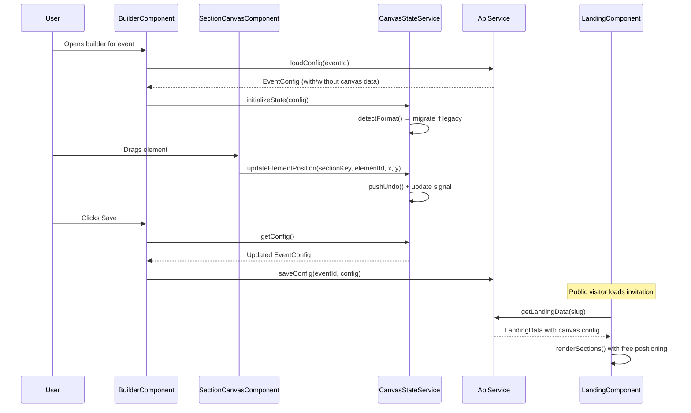

# Design Document: Builder Canvas Free Position

## Overview

This feature transforms the Vitely Builder from a section-level editor (where sections are fixed-layout Angular components) into a **free-position canvas editor** where each section acts as an independent canvas. Elements within each section (text, countdown, gallery, icons, decorators) become independently draggable, resizable objects with x/y percentage-based positioning.

The system follows a **hybrid model**: sections remain as vertical containers that can be reordered via drag-and-drop (existing behavior), but *within* each section, elements are freely positioned on a canvas. This mirrors the existing card editor (`CardsComponent`) architecture but adapts it for the multi-section landing page context.

Key goals: backward compatibility with existing `config_json` structures, responsive rendering on the public landing page, and a familiar editing experience that leverages patterns already proven in the card editor.

## Architecture



### Component Interaction Flow



## Components and Interfaces

### Component Hierarchy

```
BuilderComponent (existing, refactored)
├── BuilderToolbar (existing)
├── SectionsListPanel (left panel - lists sections + elements per section)
│   ├── SectionItem (drag handle, toggle, expand/collapse)
│   └── ElementItem (per element within expanded section)
├── CanvasViewport (center - scrollable canvas area)
│   └── SectionCanvas (one per section, position: relative container)
│       ├── CanvasElement (absolutely positioned, draggable)
│       │   ├── TextElement
│       │   ├── CountdownElement
│       │   ├── GalleryElement (unitary block)
│       │   ├── IconElement
│       │   ├── DecoratorElement
│       │   ├── ImageElement
│       │   ├── CardBlockElement (detail cards as block)
│       │   └── RsvpBlockElement (unitary block)
│       └── SnapGuides (visual alignment aids)
├── PropertiesPanel (right panel - context-sensitive)
│   ├── SectionProperties (bg, spacing, dividers)
│   └── ElementProperties (position, size, type-specific props)
└── ElementToolbar (floating - add new elements)
```

### Component 1: SectionCanvasComponent

**Purpose**: Renders a single section as a free-position canvas where child elements are absolutely positioned using percentage-based coordinates.

**Responsibilities**:
- Render section background (color, gradient, image)
- Contain and position child `CanvasElement` instances
- Handle mouse/touch events for drag-and-drop
- Display snap guides during drag operations
- Emit selection events to parent
- Manage section-level height (min-height based on content)

### Component 2: CanvasElementComponent

**Purpose**: Wraps any element type and provides drag/resize handles, selection state, and positional rendering.

**Responsibilities**:
- Render element at (x%, y%) with (width%, height%)
- Provide drag handles (move entire element)
- Provide resize handle (bottom-right corner)
- Emit position/size changes
- Show selection outline when active
- Support z-index ordering

### Component 3: CanvasStateService

**Purpose**: Central state management for the canvas editor using Angular signals.

**Responsibilities**:
- Hold the entire canvas state as signals
- Provide undo/redo stack
- Detect legacy configs and trigger migration
- Emit dirty flag for auto-save
- Compute derived state (selected element, snap targets)

## Data Models

### New Element Position Model

```typescript
/**
 * Base interface for any positioned element within a section canvas.
 * Coordinates are percentages (0-100) relative to the section container.
 */
interface CanvasElement {
  id: string;                    // UUID, unique within the section
  type: CanvasElementType;
  x: number;                     // Left position (0-100%)
  y: number;                     // Top position (0-100%)
  width: number;                 // Width (5-100%)
  height: number;                // Height (5-100%)
  zIndex: number;                // Stacking order within section
  locked?: boolean;              // Prevent accidental moves
  visible?: boolean;             // Hide without deleting
  // Responsive overrides (optional)
  mobileOverride?: ResponsiveOverride;
}

type CanvasElementType =
  | 'text'
  | 'image'
  | 'icon'
  | 'decorator'
  | 'countdown'
  | 'gallery'
  | 'detail-cards'
  | 'venue-cards'
  | 'itinerary'
  | 'rsvp-form'
  | 'gifts-block'
  | 'dresscode-block'
  | 'separator'
  | 'spacer';

interface ResponsiveOverride {
  x?: number;
  y?: number;
  width?: number;
  height?: number;
  visible?: boolean;
}
```

### Element Type-Specific Properties

```typescript
interface TextCanvasElement extends CanvasElement {
  type: 'text';
  content: string;
  fontFamily?: string;
  fontSize?: number;
  fontWeight?: number;
  color?: string;
  color2?: string;               // For gradient text
  gradientAngle?: number;
  textAlign?: 'left' | 'center' | 'right';
  lineHeight?: number;
}

interface ImageCanvasElement extends CanvasElement {
  type: 'image';
  imageUrl: string;
  objectFit?: 'cover' | 'contain' | 'fill';
  borderRadius?: number;
  opacity?: number;
}

interface IconCanvasElement extends CanvasElement {
  type: 'icon';
  iconType: 'emoji' | 'material' | 'image';
  icon: string;                  // emoji char, material icon name, or URL
  iconColor?: string;
  iconSize?: number;             // Override (default uses width)
}

interface DecoratorCanvasElement extends CanvasElement {
  type: 'decorator';
  decoratorType: 'flourish' | 'line' | 'dots' | 'sparkles' | 'wave' | 'custom';
  decoratorUrl?: string;         // For custom SVG/image decorators
  color?: string;
  opacity?: number;
  rotation?: number;             // degrees
}

interface CountdownCanvasElement extends CanvasElement {
  type: 'countdown';
  targetDate: string;            // ISO date string
  showCardBg?: boolean;
  cardBorderRadius?: number;
  labelColor?: string;
  valueColor?: string;
  valueFont?: string;
}

interface GalleryCanvasElement extends CanvasElement {
  type: 'gallery';
  displayStyle: 'carousel-3d' | 'carousel-vertical' | 'stack' | 'grid' | 'slideshow';
  title?: string;
  description?: string;
}

interface DetailCardsCanvasElement extends CanvasElement {
  type: 'detail-cards';
  cards: DetailCard[];           // Reuses existing DetailCard interface
  layout: 'grid' | 'list' | 'free';
  showCardBg?: boolean;
  cardBorderRadius?: number;
}

interface VenueCardsCanvasElement extends CanvasElement {
  type: 'venue-cards';
  items: VenueItem[];            // Reuses existing VenueItem interface
  iconStyle?: 'circle' | 'plain' | 'none';
  showCardBg?: boolean;
}

interface RsvpFormCanvasElement extends CanvasElement {
  type: 'rsvp-form';
  title?: string;
  registrationFields?: RegistrationFieldConfig[];
  showCardBg?: boolean;
}
```

### Section Canvas Model (extends existing SectionStyle)

```typescript
/**
 * Extended section config that adds canvas elements to existing sections.
 * The 'canvas' property is the key addition — if present, the section
 * renders in free-position mode. If absent, legacy rendering is used.
 */
interface CanvasSectionConfig {
  enabled: boolean;
  sectionStyle?: SectionStyle;   // Existing background/divider config
  canvas?: {
    version: 2;                  // Schema version for future migrations
    minHeight: number;           // Minimum section height in vh units
    elements: CanvasElement[];   // All positioned elements
  };
  // Legacy fields remain for backward compat (title, cards, items, etc.)
  [key: string]: any;
}

/**
 * Updated EventConfig with optional canvas data per section.
 * Backward-compatible: existing sections without 'canvas' key render as before.
 */
interface EventConfigV2 extends EventConfig {
  _version?: 2;                  // Marks config as V2 format
  hero: HeroConfig & { canvas?: CanvasSectionConfig['canvas'] };
  invitation: InvitationConfig & { canvas?: CanvasSectionConfig['canvas'] };
  details: DetailsConfig & { canvas?: CanvasSectionConfig['canvas'] };
  venues: VenuesConfig & { canvas?: CanvasSectionConfig['canvas'] };
  itinerary: ItineraryConfig & { canvas?: CanvasSectionConfig['canvas'] };
  gallery: GalleryConfig & { canvas?: CanvasSectionConfig['canvas'] };
  dresscode: DresscodeConfig & { canvas?: CanvasSectionConfig['canvas'] };
  gifts: GiftsConfig & { canvas?: CanvasSectionConfig['canvas'] };
  rsvp: RsvpConfig & { canvas?: CanvasSectionConfig['canvas'] };
}
```

### Integration with Existing config_json

The canvas data lives as an **optional `canvas` property** within each section's config object. This means:

1. **Existing configs** (without `canvas` key) continue to work — the landing page renders them using legacy section components.
2. **New/migrated configs** (with `canvas` key) use the free-position renderer.
3. The `_version` field at the top level signals which rendering mode to use globally.

```typescript
// Example: config_json in database after migration
{
  "_version": 2,
  "hero": {
    "backgroundGif": "...",
    "audioUrl": "...",
    "eventDescription": "Nuestra Boda",
    "canvas": {
      "version": 2,
      "minHeight": 100,
      "elements": [
        { "id": "el-1", "type": "text", "x": 10, "y": 20, "width": 80, "height": 15,
          "zIndex": 1, "content": "Nuestra Boda", "fontSize": 48, "fontWeight": 700,
          "color": "#ffffff", "textAlign": "center" },
        { "id": "el-2", "type": "countdown", "x": 25, "y": 70, "width": 50, "height": 20,
          "zIndex": 2, "targetDate": "2025-03-15T18:00:00" }
      ]
    }
  },
  "details": {
    "enabled": true,
    "title": "Detalles",
    "cards": [...],  // Legacy data preserved
    "canvas": {
      "version": 2,
      "minHeight": 60,
      "elements": [
        { "id": "el-3", "type": "text", "x": 20, "y": 5, "width": 60, "height": 10,
          "zIndex": 1, "content": "Detalles", "fontSize": 32 },
        { "id": "el-4", "type": "detail-cards", "x": 5, "y": 20, "width": 90, "height": 70,
          "zIndex": 2, "cards": [...], "layout": "grid" }
      ]
    }
  }
}
```

## Algorithmic Pseudocode

### Main Drag Algorithm

```typescript
/**
 * Core drag algorithm - mirrors CardsComponent pattern but scoped to section.
 * Positions stored as percentages for responsiveness.
 */
function onDragMove(
  clientX: number,
  clientY: number,
  dragging: CanvasElement,
  sectionRect: DOMRect,
  dragStartX: number,
  dragStartY: number,
  elStartX: number,
  elStartY: number,
  siblingElements: CanvasElement[],
  snapThreshold: number = 2
): { newX: number; newY: number; guides: SnapGuides } {

  // Convert pixel delta to percentage
  const dx = ((clientX - dragStartX) / sectionRect.width) * 100;
  const dy = ((clientY - dragStartY) / sectionRect.height) * 100;

  // Clamp within bounds [0, 100 - elementWidth]
  let newX = Math.round(Math.max(0, Math.min(100 - dragging.width, elStartX + dx)));
  let newY = Math.round(Math.max(0, Math.min(100 - dragging.height, elStartY + dy)));

  const guides: SnapGuides = { vertical: null, horizontal: null };

  // Snap to section center
  const elCenterX = newX + dragging.width / 2;
  const elCenterY = newY + dragging.height / 2;

  if (Math.abs(elCenterX - 50) < snapThreshold) {
    newX = 50 - dragging.width / 2;
    guides.vertical = 50;
  }
  if (Math.abs(elCenterY - 50) < snapThreshold) {
    newY = 50 - dragging.height / 2;
    guides.horizontal = 50;
  }

  // Snap to sibling elements (edges and centers)
  for (const sibling of siblingElements) {
    if (sibling.id === dragging.id) continue;
    const sibCenterX = sibling.x + sibling.width / 2;
    const sibCenterY = sibling.y + sibling.height / 2;

    // Center alignment
    if (Math.abs(elCenterX - sibCenterX) < snapThreshold) {
      newX = sibCenterX - dragging.width / 2;
      guides.vertical = sibCenterX;
    }
    if (Math.abs(elCenterY - sibCenterY) < snapThreshold) {
      newY = sibCenterY - dragging.height / 2;
      guides.horizontal = sibCenterY;
    }
    // Left-edge alignment
    if (Math.abs(newX - sibling.x) < snapThreshold) {
      newX = sibling.x;
      guides.vertical = sibling.x;
    }
    // Right-edge alignment
    if (Math.abs(newX + dragging.width - sibling.x - sibling.width) < snapThreshold) {
      newX = sibling.x + sibling.width - dragging.width;
      guides.vertical = sibling.x + sibling.width;
    }
  }

  return { newX: Math.round(newX), newY: Math.round(newY), guides };
}

interface SnapGuides {
  vertical: number | null;   // x% position for vertical guide line
  horizontal: number | null; // y% position for horizontal guide line
}
```

### Migration Algorithm

```typescript
/**
 * Migrates a legacy EventConfig (V1) to EventConfigV2 with canvas data.
 * Each section's existing content is mapped to positioned elements
 * using sensible default positions based on section type.
 */
function migrateToCanvasFormat(config: EventConfig): EventConfigV2 {
  const migrated = { ...config, _version: 2 } as EventConfigV2;

  // Hero section migration
  migrated.hero.canvas = {
    version: 2,
    minHeight: 100, // Full viewport height
    elements: buildHeroElements(config.hero)
  };

  // Details section migration
  if (config.details.enabled) {
    migrated.details.canvas = {
      version: 2,
      minHeight: 60,
      elements: buildDetailElements(config.details)
    };
  }

  // Venues section migration
  if (config.venues.enabled) {
    migrated.venues.canvas = {
      version: 2,
      minHeight: 50,
      elements: buildVenueElements(config.venues)
    };
  }

  // ... repeat for each section type

  return migrated;
}

function buildHeroElements(hero: HeroConfig): CanvasElement[] {
  const elements: CanvasElement[] = [];
  let zIndex = 1;

  // Event description text
  if (hero.eventDescription) {
    elements.push({
      id: generateId(),
      type: 'text',
      x: 10, y: 25, width: 80, height: 15,
      zIndex: zIndex++,
      content: hero.eventDescription,
      fontSize: hero.eventDescriptionStyle?.fontSize || 24,
      fontFamily: hero.eventDescriptionStyle?.fontFamily,
      color: hero.eventDescriptionStyle?.color1 || '#ffffff',
      textAlign: 'center'
    } as TextCanvasElement);
  }

  // Celebrant names
  if (hero.celebrantNames && hero.showCelebrantNames !== false) {
    elements.push({
      id: generateId(),
      type: 'text',
      x: 5, y: 40, width: 90, height: 20,
      zIndex: zIndex++,
      content: hero.celebrantNames,
      fontSize: hero.celebrantNamesStyle?.fontSize || 48,
      fontFamily: hero.celebrantNamesStyle?.fontFamily,
      color: hero.celebrantNamesStyle?.color1 || '#ffffff',
      textAlign: 'center'
    } as TextCanvasElement);
  }

  // Countdown
  elements.push({
    id: generateId(),
    type: 'countdown',
    x: 15, y: 70, width: 70, height: 20,
    zIndex: zIndex++,
    targetDate: hero.countdownDate,
    showCardBg: hero.countdownShowCardBg
  } as CountdownCanvasElement);

  return elements;
}
```

### Rendering Pipeline (Landing Page)

```typescript
/**
 * Determines rendering strategy per section.
 * Backward-compatible: sections without canvas data render using legacy components.
 */
function getSectionRenderer(
  sectionKey: string,
  sectionConfig: any
): 'free-position' | 'legacy' {
  if (sectionConfig?.canvas?.version === 2 && sectionConfig.canvas.elements?.length > 0) {
    return 'free-position';
  }
  return 'legacy';
}

/**
 * Renders a section in free-position mode on the landing page.
 * Elements are positioned absolutely within a relative container.
 * Mobile override applied when viewport < 768px.
 */
function renderFreePositionSection(
  canvas: { version: number; minHeight: number; elements: CanvasElement[] },
  isMobile: boolean
): RenderedSection {
  const elements = canvas.elements
    .filter(el => {
      const visible = isMobile
        ? (el.mobileOverride?.visible ?? el.visible ?? true)
        : (el.visible ?? true);
      return visible;
    })
    .sort((a, b) => a.zIndex - b.zIndex)
    .map(el => {
      if (isMobile && el.mobileOverride) {
        return {
          ...el,
          x: el.mobileOverride.x ?? el.x,
          y: el.mobileOverride.y ?? el.y,
          width: el.mobileOverride.width ?? el.width,
          height: el.mobileOverride.height ?? el.height,
        };
      }
      return el;
    });

  return {
    minHeight: canvas.minHeight,
    elements
  };
}
```

## Key Functions with Formal Specifications

### Function 1: updateElementPosition()

```typescript
function updateElementPosition(
  state: CanvasState,
  sectionKey: string,
  elementId: string,
  newX: number,
  newY: number
): CanvasState
```

**Preconditions:**
- `state` contains a section with key `sectionKey`
- Section contains an element with id `elementId`
- `0 <= newX <= 100 - element.width`
- `0 <= newY <= 100 - element.height`

**Postconditions:**
- Returns new state with element at updated position
- Previous state is preserved in undo stack
- Only the targeted element is modified
- `isDirty` flag is set to `true`

**Loop Invariants:** N/A (direct lookup by id)

### Function 2: resizeElement()

```typescript
function resizeElement(
  state: CanvasState,
  sectionKey: string,
  elementId: string,
  newWidth: number,
  newHeight: number
): CanvasState
```

**Preconditions:**
- `state` contains a section with key `sectionKey`
- Section contains an element with id `elementId`
- `5 <= newWidth <= 100`
- `5 <= newHeight <= 100`
- `element.x + newWidth <= 100` (element stays within bounds)

**Postconditions:**
- Returns new state with element at updated dimensions
- Element position (x, y) remains unchanged
- Previous state is preserved in undo stack
- `isDirty` flag is set to `true`

### Function 3: addElement()

```typescript
function addElement(
  state: CanvasState,
  sectionKey: string,
  elementType: CanvasElementType,
  initialProps?: Partial<CanvasElement>
): CanvasState
```

**Preconditions:**
- `state` contains a section with key `sectionKey`
- `elementType` is a valid CanvasElementType
- Section enabled (cannot add to disabled sections)

**Postconditions:**
- Returns new state with new element added to section
- New element has unique `id` (UUID v4)
- New element has `zIndex` = max(existing zIndexes) + 1
- Default position: centered (x=25, y=25, width=50, height=30) unless overridden
- `isDirty` flag is set to `true`

### Function 4: migrateConfig()

```typescript
function migrateConfig(config: EventConfig): EventConfigV2
```

**Preconditions:**
- `config` is a valid EventConfig (V1 format)
- `config._version` is undefined or 1

**Postconditions:**
- Returns EventConfigV2 with `_version === 2`
- All existing section properties preserved unchanged
- Each enabled section has a `canvas` property with mapped elements
- Legacy rendering still works (original fields untouched)
- Idempotent: calling on already-V2 config returns same config

## Example Usage

```typescript
// Example 1: Builder initializes and migrates config
@Component({ ... })
export class BuilderComponent implements OnInit {
  private canvasState = inject(CanvasStateService);

  ngOnInit() {
    this.api.getConfig(this.eventId).subscribe(config => {
      // Auto-migrate if needed
      const v2Config = this.canvasState.initializeState(config);
      this.config.set(v2Config);
    });
  }
}

// Example 2: Dragging an element in SectionCanvasComponent
@Component({ ... })
export class SectionCanvasComponent {
  @Input() sectionKey!: string;
  @Input() elements!: CanvasElement[];

  private canvasState = inject(CanvasStateService);

  onMouseDown(event: MouseEvent, element: CanvasElement) {
    event.preventDefault();
    this.canvasState.selectElement(this.sectionKey, element.id);
    this.canvasState.pushUndo();
    this.startDrag(event.clientX, event.clientY, element);
  }

  private onDragMove(clientX: number, clientY: number) {
    const rect = this.canvasEl.nativeElement.getBoundingClientRect();
    const { newX, newY, guides } = onDragMove(
      clientX, clientY, this.dragging!, rect,
      this.dragStartX, this.dragStartY,
      this.elStartX, this.elStartY,
      this.elements, 2
    );
    this.canvasState.updateElementPosition(this.sectionKey, this.dragging!.id, newX, newY);
    this.snapGuides.set(guides);
  }
}

// Example 3: Landing page renders free-position section
@Component({
  template: `
    @for (section of enabledSections(); track section.key) {
      <section [style.min-height.vh]="section.canvas?.minHeight || 'auto'"
               [style.position]="'relative'"
               [style.background]="getSectionBg(section.sectionStyle)">
        @if (section.canvas) {
          @for (el of section.canvas.elements; track el.id) {
            <div [style.position]="'absolute'"
                 [style.left.%]="getPos(el).x"
                 [style.top.%]="getPos(el).y"
                 [style.width.%]="getPos(el).width"
                 [style.height.%]="getPos(el).height"
                 [style.z-index]="el.zIndex">
              <app-canvas-element-renderer [element]="el" [config]="config()" />
            </div>
          }
        } @else {
          <!-- Legacy rendering with existing section components -->
          <ng-container [ngSwitch]="section.key">...</ng-container>
        }
      </section>
    }
  `
})
export class LandingComponent { ... }
```

## Correctness Properties

*A property is a characteristic or behavior that should hold true across all valid executions of a system—essentially, a formal statement about what the system should do. Properties serve as the bridge between human-readable specifications and machine-verifiable correctness guarantees.*

### Property 1: Elements stay within section bounds

*For any* element in a section canvas after any drag or resize operation, the position must satisfy: `x >= 0`, `x + width <= 100`, `y >= 0`, and `y + height <= 100`.

**Validates: Requirements 1.2, 2.2, 8.4**

### Property 2: Element IDs are unique within a section

*For any* section canvas, the count of unique element IDs equals the total element count. Adding elements always produces IDs not already present in the section.

**Validates: Requirements 3.1, 9.1**

### Property 3: Migration is lossless

*For any* valid legacy EventConfig, migrating to V2 format preserves all original field values unchanged. Legacy fields remain accessible and identical after migration.

**Validates: Requirements 5.2**

### Property 4: Renderer selection based on canvas presence

*For any* section config, if the `canvas` property is absent or has an empty elements array, `getSectionRenderer` returns `'legacy'`. If `canvas.version === 2` and elements array is non-empty, it returns `'free-position'`.

**Validates: Requirements 6.1, 6.2**

### Property 5: Undo/Redo round-trip consistency

*For any* sequence of N operations followed by an undo, the state equals the state after N-1 operations. For any undo followed by a redo, the state equals the state before the undo.

**Validates: Requirements 4.1, 4.2**

### Property 6: zIndex render ordering

*For any* set of canvas elements in a section, the rendered output is sorted in ascending zIndex order (lower zIndex rendered behind, higher in front).

**Validates: Requirements 6.3, 9.2**

### Property 7: Resize respects minimum dimensions

*For any* resize operation on an element, the resulting width and height are both >= 5%. No resize operation can produce dimensions below the minimum threshold.

**Validates: Requirements 2.1**

### Property 8: Migration idempotency

*For any* EventConfig, calling `migrateConfig()` on an already-migrated V2 config produces an identical result: `migrateConfig(migrateConfig(config))` equals `migrateConfig(config)`.

**Validates: Requirements 5.4**

### Property 9: Drag produces integer percentage coordinates

*For any* drag operation regardless of pixel-level input, the stored position values (x, y) are integer percentages (rounded values).

**Validates: Requirements 1.1, 1.5**

### Property 10: Snap guide triggers at threshold

*For any* element being dragged, snap guides appear when the element center is within 2% of the section center (50%) or within 2% of a sibling element's center or edges.

**Validates: Requirements 1.3, 1.4**

### Property 11: Resize preserves element position

*For any* resize operation on an element, the element's x and y coordinates remain unchanged after the resize completes.

**Validates: Requirements 2.3**

### Property 12: New element zIndex assignment

*For any* section with existing elements, adding a new element assigns it a zIndex equal to `max(existing zIndexes) + 1`.

**Validates: Requirements 3.2**

### Property 13: Visibility filtering

*For any* set of canvas elements, the rendered output excludes all elements where `visible === false`. On mobile viewports, elements with `mobileOverride.visible === false` are also excluded.

**Validates: Requirements 6.4, 7.3**

### Property 14: Mobile position resolution

*For any* element rendered on a mobile viewport (< 768px), if `mobileOverride` exists, its x/y/width/height values are used. If no `mobileOverride` exists, the base desktop percentage positions are used.

**Validates: Requirements 7.1, 7.2**

### Property 15: Mobile edit isolation

*For any* element edited while in mobile preview mode, only the `mobileOverride` property is modified. The base position (x, y, width, height) remains unchanged.

**Validates: Requirements 7.4**

### Property 16: Validation filters invalid elements

*For any* set of canvas elements loaded from config, elements missing required fields (id, type, x, y, width, height, zIndex) are removed from the active canvas. Only valid elements remain.

**Validates: Requirements 8.1, 8.2**

### Property 17: Dirty flag on modification

*For any* state change (position, size, property edit, add, remove), the `isDirty` flag is set to `true`.

**Validates: Requirements 10.1**

### Property 18: Save/load round-trip

*For any* valid EventConfigV2, serializing (saving) and then deserializing (loading) produces an equivalent configuration with identical element positions and properties.

**Validates: Requirements 10.3**

### Property 19: Locked elements are immutable

*For any* element with `locked === true`, drag and resize operations produce no change to the element's position or dimensions.

**Validates: Requirements 11.4**

### Property 20: Undo stack cap

*For any* sequence of operations exceeding 50, the undo stack size never exceeds 50 entries.

**Validates: Requirements 4.3**

### Property 21: Stacking reorder preserves relative order

*For any* zIndex reorder operation on a single element, the relative zIndex order of all other unaffected elements remains the same.

**Validates: Requirements 9.3**

## Error Handling

### Error Scenario 1: Corrupted Canvas Data

**Condition**: `canvas.elements` contains malformed entries (missing id, invalid type, NaN positions)
**Response**: Validate each element on load; remove invalid entries and log warning
**Recovery**: Fall back to legacy rendering for that section if all elements are invalid

### Error Scenario 2: Migration Failure

**Condition**: Legacy config has unexpected structure (missing required fields)
**Response**: Wrap migration in try/catch; on failure, leave section without canvas data
**Recovery**: Section renders in legacy mode; user can manually add elements in builder

### Error Scenario 3: Concurrent Edits (Auto-save Conflict)

**Condition**: Two browser tabs editing same event simultaneously
**Response**: Last-write-wins (existing behavior); display "config was updated externally" toast
**Recovery**: Reload button to fetch latest; undo stack is local-only

### Error Scenario 4: Mobile Viewport Position Overflow

**Condition**: Element positioned at x=80 with width=40 (total 120% on narrow screen)
**Response**: Clamp on render: `Math.min(x, 100 - width)` applied at display time
**Recovery**: Visual clamp only; stored value unchanged for desktop restoration

## Testing Strategy

### Unit Testing Approach

- Test `migrateConfig()` with various V1 configs (empty sections, full sections, edge cases)
- Test position clamping: values > 100, < 0, NaN
- Test `addElement()` generates unique IDs and correct zIndex
- Test `removeElement()` cleans up correctly and adjusts selection
- Test snap guide calculation with known element positions
- Test `getSectionRenderer()` detection logic

### Property-Based Testing Approach

**Property Test Library**: fast-check

```typescript
// Property: drag operations always produce valid positions
fc.assert(
  fc.property(
    fc.record({
      x: fc.integer({ min: 0, max: 100 }),
      y: fc.integer({ min: 0, max: 100 }),
      width: fc.integer({ min: 5, max: 100 }),
      height: fc.integer({ min: 5, max: 100 }),
    }),
    fc.integer({ min: -200, max: 200 }), // dx pixels
    fc.integer({ min: -200, max: 200 }), // dy pixels
    (el, dx, dy) => {
      const result = computeNewPosition(el, dx, dy, 1000, 600);
      return result.x >= 0 && result.x + el.width <= 100
          && result.y >= 0 && result.y + el.height <= 100;
    }
  )
);

// Property: migration is idempotent
fc.assert(
  fc.property(arbitraryEventConfig, (config) => {
    const once = migrateConfig(config);
    const twice = migrateConfig(once);
    return JSON.stringify(once) === JSON.stringify(twice);
  })
);
```

### Integration Testing Approach

- E2E test: Open builder → drag element → save → reload → verify position persisted
- E2E test: Load landing page with V2 config → verify elements render at correct positions
- E2E test: Load landing page with V1 config → verify legacy rendering unchanged
- E2E test: Mobile viewport → verify mobileOverride positions applied

## Performance Considerations

| Concern | Mitigation |
|---------|-----------|
| Drag performance (many elements) | Use `requestAnimationFrame` for move updates; avoid Angular change detection during drag |
| Section with 15+ elements | Elements are simple divs with absolute positioning — DOM is shallow; no performance issue |
| Large config JSON | Canvas data adds ~1-2KB per section; total config stays under 50KB |
| Landing page render time | Elements are simple positioned divs; no complex layout calculations |
| Mobile responsive recalc | `mobileOverride` checked once on load; no continuous reflow |
| Undo/redo memory | Cap stack at 50 entries; store diffs instead of full snapshots if needed |

### Optimization Strategy

1. **OnPush change detection** for all canvas components
2. **Signal-based state** to minimize unnecessary re-renders
3. **Track by `el.id`** in all `@for` loops for efficient DOM recycling
4. **Throttle drag events** to max 60fps using `requestAnimationFrame`
5. **Lazy render** elements outside viewport (IntersectionObserver on landing page)

## Security Considerations

- Canvas element data is sanitized server-side before storage (same as current config JSON handling via `ensureConfigDefaults.js`)
- Image URLs within elements validated against allowed upload paths
- No executable code in element content (text elements stripped of `<script>` tags via existing `sanitize.js`)
- Config size limit enforced server-side (existing 500KB max payload)

## Drag & Drop Implementation

### CDK vs Custom: Decision

**Decision: Custom implementation** (same as card editor)

**Rationale**:
- Angular CDK DragDrop is optimized for list reordering, not free-form 2D positioning
- The card editor already proves the custom approach works well with percentage-based positioning
- Custom gives full control over snap guides, bounds checking, and mobile touch handling
- CDK remains used for section reordering (vertical list — existing behavior)

### Implementation Approach

The drag system replicates the proven `CardsComponent` pattern:

1. **mousedown/touchstart** on element → record start position, attach document-level listeners
2. **mousemove/touchmove** → compute delta as % of container, apply snap, update element position signal
3. **mouseup/touchend** → remove listeners, finalize position, clear snap guides

Key differences from card editor:
- Multiple sections (each is an independent canvas)
- Section-scoped element lists (snap only to siblings within same section)
- Mobile override editing mode (toggle between desktop/mobile positioning)

## Responsive Strategy (Landing Page)

### Approach: Percentage + Optional Mobile Override

Since all positions are stored as percentages, they scale proportionally across viewport widths. However, some layouts need explicit mobile adjustments:

```typescript
// Landing page rendering logic
function getElementPosition(el: CanvasElement, isMobile: boolean): Position {
  if (isMobile && el.mobileOverride) {
    return {
      x: el.mobileOverride.x ?? el.x,
      y: el.mobileOverride.y ?? el.y,
      width: el.mobileOverride.width ?? el.width,
      height: el.mobileOverride.height ?? el.height,
    };
  }
  return { x: el.x, y: el.y, width: el.width, height: el.height };
}
```

### Builder Mobile Editing Mode

The builder includes a toggle to edit mobile positions:
1. Switch preview device to "mobile" (existing button)
2. Elements show their `mobileOverride` positions (or desktop positions if no override)
3. Dragging in mobile mode updates `mobileOverride` instead of base position
4. Elements without `mobileOverride` inherit desktop positions

### Default Responsive Behavior

Without explicit `mobileOverride`:
- Percentage positions work naturally (an element at x=10%, width=80% stays readable)
- Section `minHeight` in `vh` adapts to viewport
- Font sizes may need CSS `clamp()` for readability (handled in element renderer)

## Migration Strategy

### Phase 1: Dual-Mode Support

1. Add `canvas` property to section interfaces (optional)
2. Landing page checks for `canvas` presence → uses free-position renderer OR legacy
3. Builder detects format → shows either new canvas editor OR legacy section editor
4. No forced migration — existing events stay in V1

### Phase 2: Builder Migration Button

1. Add "Upgrade to Canvas Mode" button per section in builder
2. On click: runs `migrateConfig()` for that section only
3. User can preview result before saving
4. Undo available if result is unsatisfactory

### Phase 3: Gradual Auto-Migration

1. New events created after this feature ships default to V2 format
2. Existing events migrated on next builder open (with confirmation dialog)
3. Backend migration script available for bulk migration

### Migration Safety

- Legacy fields **never deleted** — they coexist with `canvas` data
- If `canvas` data is removed (rollback), sections revert to legacy rendering automatically
- Backend `ensureConfigDefaults.js` updated to handle V2 fields gracefully

## Section Types and Default Elements

| Section | Default Elements on Migration |
|---------|------------------------------|
| Hero | text (event description), text (celebrant names), countdown, hero phrase text |
| Invitation | text (title), text (subtitle), text (invitation body) |
| Details | text (section title), detail-cards block |
| Venues | text (section title), venue-cards block |
| Itinerary | text (section title), itinerary block |
| Gallery | text (title), text (description), gallery block |
| Dresscode | text (title), dresscode-block |
| Gifts | text (title), text (description), gifts-block |
| RSVP | text (title), rsvp-form block |

**Complex blocks** (gallery, rsvp-form, detail-cards, venue-cards, etc.) are rendered as single unitary elements — internally they use their existing Angular component logic, but positioned as one block on the canvas.

## Dependencies

| Dependency | Purpose | Status |
|-----------|---------|--------|
| `@angular/cdk` | DragDrop for section reordering (existing) | Already installed |
| `uuid` or `crypto.randomUUID()` | Generate element IDs | Built-in (browser API) |
| Angular Signals | State management | Already in use (Angular 18) |
| fast-check | Property-based testing | Dev dependency to add |

No new external dependencies required for core functionality. The implementation leverages existing Angular CDK (for section reordering only) and native browser APIs for the custom drag system.
