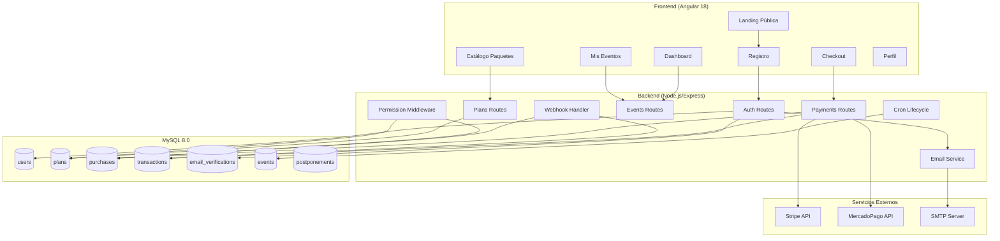
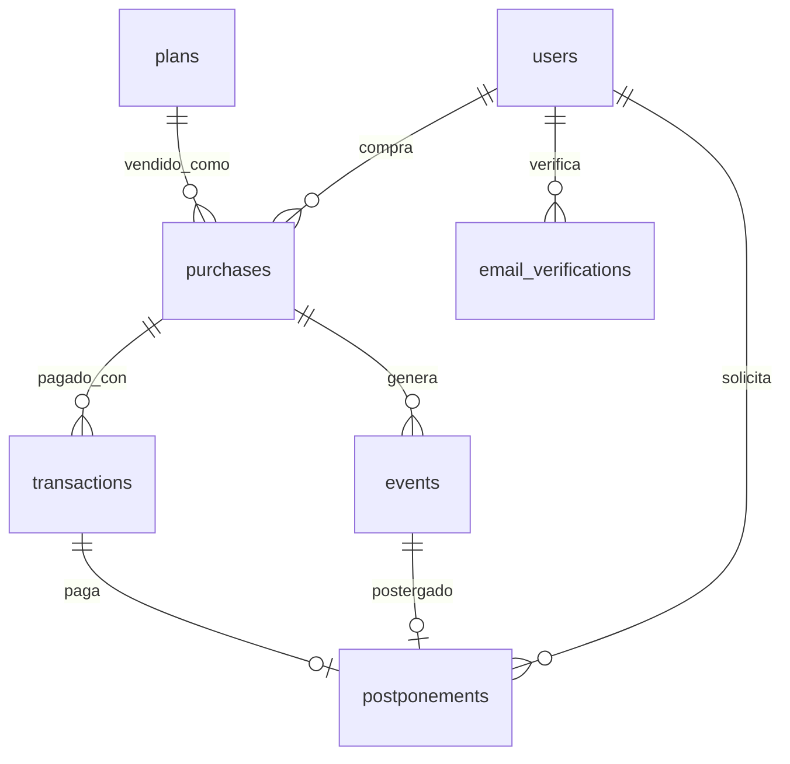
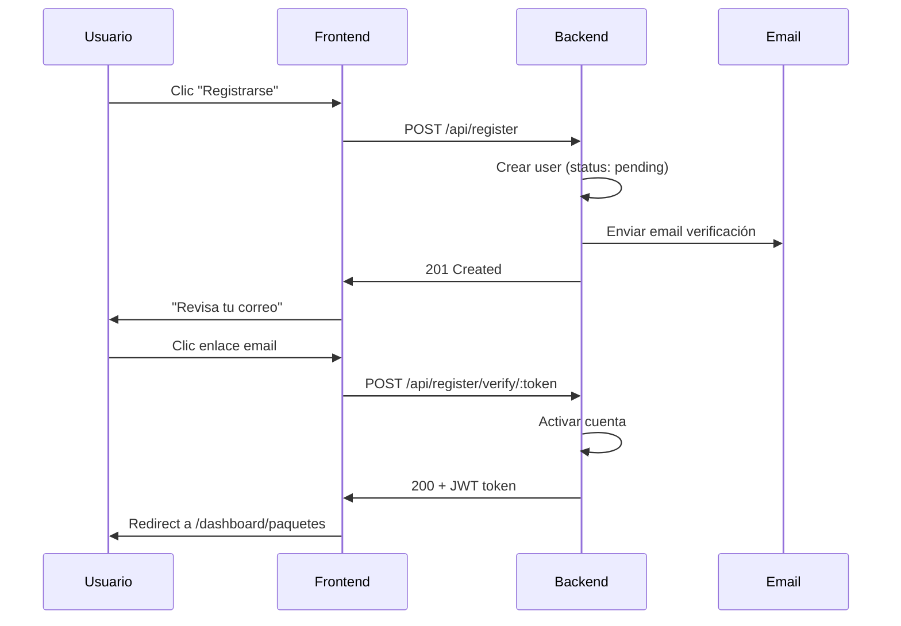
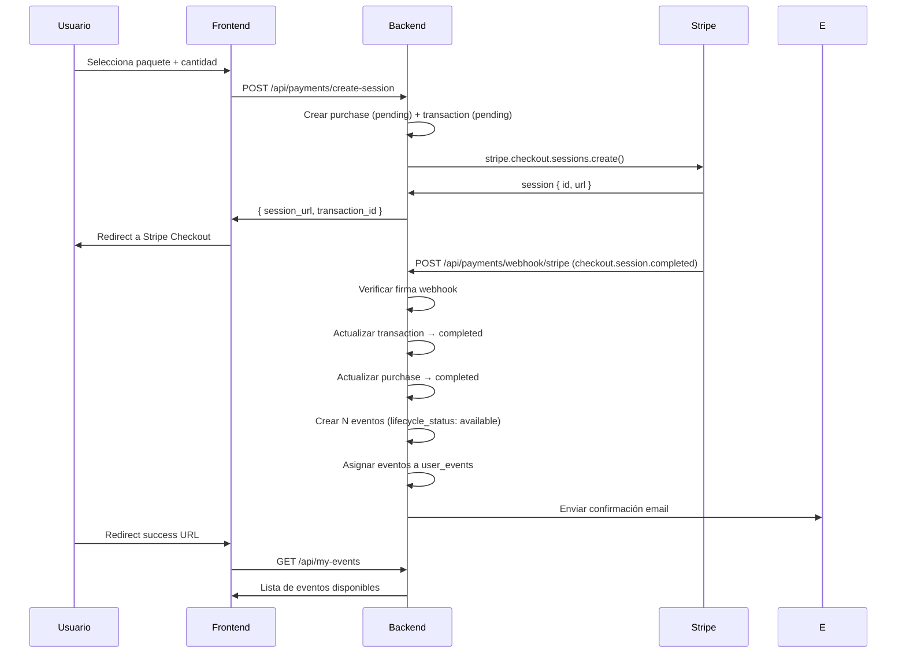
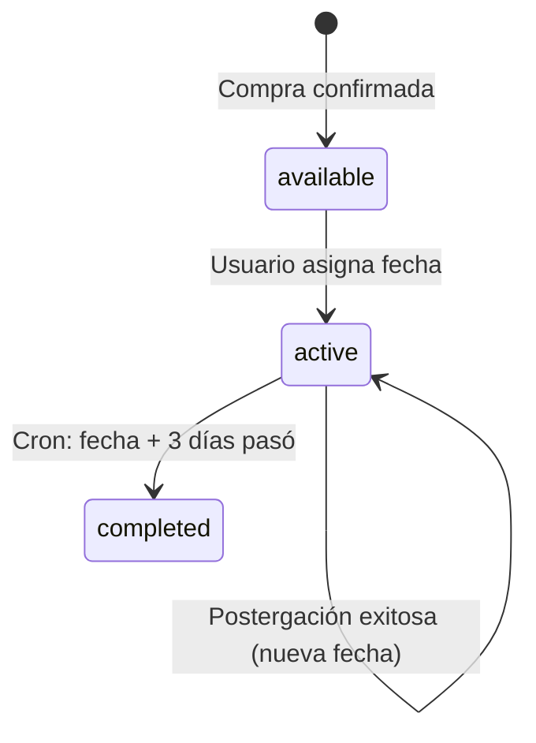

# Design Document

## Overview

Este documento describe el diseño técnico del sistema de comercialización para Vitely. Se implementa un modelo de pago por evento (pay-per-event) donde los usuarios se auto-registran, seleccionan un paquete, pagan una vez y acceden a las funcionalidades correspondientes. No hay suscripciones recurrentes.

El sistema se integra con la arquitectura existente (Angular 18 + Node.js/Express + MySQL 8.0) añadiendo:
- Módulo de auto-registro con verificación por email
- Catálogo de paquetes con administración
- Procesamiento de pagos con Stripe y MercadoPago
- Ciclo de vida automático de eventos (activación/desactivación por fecha)
- Control de acceso granular por paquete adquirido
- Panel de administración de compras y métricas

### Decisiones de Diseño Clave

| Decisión | Justificación |
|----------|---------------|
| Stripe + MercadoPago | Cobertura internacional + Latinoamérica (tarjetas, transferencias, OXXO, PSE) |
| Nodemailer + SMTP | Solución simple sin vendor lock-in; migrable a SendGrid si escala |
| node-cron para lifecycle | Documentado para versión futura; v1 usa desactivación manual por admin |
| Permisos evaluados en cada request | Consistencia garantizada; sin cache que pueda quedar stale |
| Webhooks para confirmación de pago | Patrón estándar; no depende del redirect del usuario |

## Architecture

### Diagrama de Arquitectura



### Integración con Sistema Existente

El sistema se integra de forma aditiva, sin modificar el flujo existente de admin/client creados manualmente:

1. **Tabla `users`**: Se agregan columnas `email`, `email_verified`, `verification_status`, `self_registered`
2. **Tabla `events`**: Se agregan columnas `lifecycle_status`, `deactivation_date`, `purchase_id`
3. **Nuevas tablas**: `plans`, `purchases`, `transactions`, `email_verifications`, `postponements`
4. **Nuevo middleware**: `requirePackageAccess` se encadena después de `requireEventAccess`
5. **Nuevas rutas**: `/api/register`, `/api/plans`, `/api/payments`, `/api/my-events`, `/api/profile`
6. **Administración de lifecycle**: Endpoints manuales para que root/admin desactiven eventos expirados (cron job documentado para versión futura)

Los usuarios admin-created existentes siguen funcionando igual — el sistema de permisos por paquete solo aplica a usuarios `self_registered: true`.

## Components and Interfaces

### Backend Components

#### 1. Email Service (`src/services/email.service.js`)

```javascript
// Interface
class EmailService {
  async sendVerificationEmail(to, token, name) → void
  async sendPaymentConfirmation(to, purchaseDetails) → void
  async sendPostponementConfirmation(to, eventDetails) → void
  async resendVerification(userId) → void
}
```

Usa `nodemailer` con transporte SMTP configurable via variables de entorno (`SMTP_HOST`, `SMTP_PORT`, `SMTP_USER`, `SMTP_PASS`, `SMTP_FROM`).

#### 2. Payment Service (`src/services/payment.service.js`)

```javascript
// Interface
class PaymentService {
  async createStripeSession(userId, planId, quantity, successUrl, cancelUrl) → { sessionId, url }
  async createMercadoPagoPreference(userId, planId, quantity, successUrl, cancelUrl) → { preferenceId, initPoint }
  async handleStripeWebhook(rawBody, signature) → { eventType, data }
  async handleMPWebhook(body) → { eventType, data }
  async processPostponementPayment(userId, eventId, gateway) → { sessionId, url }
}
```

#### 3. Lifecycle Service (`src/services/lifecycle.service.js`)

```javascript
// Interface
class LifecycleService {
  async deactivateExpiredEvents() → { deactivatedCount }
  async calculateDeactivationDate(eventDate) → Date  // eventDate + 3 days
  async getEventLifecycleStatus(eventId) → 'available' | 'active' | 'completed'
}
```

#### 4. Permission Middleware (`src/middleware/packageAccess.js`)

```javascript
// Middleware factory
function requirePackageFeature(feature) → ExpressMiddleware
// feature: 'landing_builder' | 'card_editor' | 'all'

function requireActiveEvent(req, res, next) → void
// Verifica que el evento no esté completado
```

### Frontend Components

#### 1. Páginas Públicas (Standalone Components)

| Componente | Ruta | Descripción |
|-----------|------|-------------|
| `RegisterComponent` | `/registro` | Formulario de registro con validación |
| `VerifyEmailComponent` | `/verificar/:token` | Verificación de email |
| `PricingPublicComponent` | `/paquetes` | Catálogo público (sección landing) |

#### 2. Páginas Dashboard (Standalone Components)

| Componente | Ruta | Descripción |
|-----------|------|-------------|
| `PlansCatalogComponent` | `/dashboard/paquetes` | Catálogo con checkout |
| `CheckoutComponent` | `/dashboard/checkout` | Flujo de pago |
| `MyEventsComponent` | `/dashboard/mis-eventos` | Estado de eventos comprados |
| `PostponeModalComponent` | — | Modal de postergación |
| `ProfileComponent` | `/dashboard/perfil` | Gestión de cuenta |
| `PurchasesAdminComponent` | `/dashboard/compras` | Admin: listado compras |
| `MetricsComponent` | `/dashboard/metricas` | Admin: dashboard métricas |

#### 3. Guards y Services

| Servicio/Guard | Función |
|---------------|---------|
| `PackageGuard` | Bloquea acceso a features no incluidas en paquete |
| `VerifiedGuard` | Bloquea dashboard si email no verificado |
| `PlansService` | CRUD paquetes, catálogo |
| `PaymentService` | Crear sesiones de pago |
| `MyEventsService` | Estado de eventos del usuario |
| `ProfileService` | Actualizar perfil |

## Data Models

### Nuevas Tablas

#### `plans`

| Columna | Tipo | Descripción |
|---------|------|-------------|
| id | INT PK AUTO_INCREMENT | — |
| name | VARCHAR(100) | Nombre del paquete |
| slug | VARCHAR(100) UNIQUE | Identificador URL-friendly |
| description | TEXT | Descripción para catálogo |
| price | DECIMAL(10,2) | Precio unitario por evento (MXN) |
| features | JSON | Array de features incluidas |
| max_guests | INT | Límite de invitados (NULL = ilimitado) |
| is_trial | TINYINT(1) DEFAULT 0 | Si es paquete trial |
| trial_days | INT DEFAULT NULL | Duración trial en días |
| volume_discount | JSON | Reglas de descuento `[{min_qty, discount_pct}]` |
| status | ENUM('active','inactive') DEFAULT 'active' | Visibilidad |
| sort_order | INT DEFAULT 0 | Orden en catálogo |
| created_at | DATETIME DEFAULT CURRENT_TIMESTAMP | — |
| updated_at | DATETIME ON UPDATE CURRENT_TIMESTAMP | — |

**features JSON ejemplo:**
```json
["landing_builder", "card_editor", "pdf_export", "qr_codes", "guest_management"]
```

#### `purchases`

| Columna | Tipo | Descripción |
|---------|------|-------------|
| id | INT PK AUTO_INCREMENT | — |
| user_id | INT FK → users.id | Comprador |
| plan_id | INT FK → plans.id | Paquete comprado |
| quantity | INT DEFAULT 1 | Cantidad de eventos |
| unit_price | DECIMAL(10,2) | Precio unitario al momento de compra |
| discount_pct | DECIMAL(5,2) DEFAULT 0 | Descuento aplicado |
| total_amount | DECIMAL(10,2) | Monto total cobrado |
| status | ENUM('pending','completed','failed','refunded') | Estado |
| events_assigned | INT DEFAULT 0 | Eventos ya asignados de esta compra |
| created_at | DATETIME DEFAULT CURRENT_TIMESTAMP | — |

#### `transactions`

| Columna | Tipo | Descripción |
|---------|------|-------------|
| id | INT PK AUTO_INCREMENT | — |
| purchase_id | INT FK → purchases.id NULL | Compra asociada (NULL para postergaciones) |
| user_id | INT FK → users.id | Usuario |
| gateway | ENUM('stripe','mercadopago') | Pasarela usada |
| gateway_session_id | VARCHAR(500) | ID sesión en pasarela |
| gateway_payment_id | VARCHAR(500) | ID pago confirmado |
| amount | DECIMAL(10,2) | Monto |
| currency | VARCHAR(3) DEFAULT 'MXN' | Moneda |
| status | ENUM('pending','completed','failed','refunded') | Estado |
| type | ENUM('purchase','postponement') DEFAULT 'purchase' | Tipo |
| metadata | JSON | Datos adicionales de la pasarela |
| created_at | DATETIME DEFAULT CURRENT_TIMESTAMP | — |
| updated_at | DATETIME ON UPDATE CURRENT_TIMESTAMP | — |

#### `email_verifications`

| Columna | Tipo | Descripción |
|---------|------|-------------|
| id | INT PK AUTO_INCREMENT | — |
| user_id | INT FK → users.id | Usuario |
| token | VARCHAR(255) UNIQUE | Token de verificación (UUID) |
| type | ENUM('registration','email_change') | Tipo |
| new_email | VARCHAR(255) NULL | Nuevo email (para cambios) |
| expires_at | DATETIME | Expiración (24h después de creación) |
| used_at | DATETIME NULL | Cuándo se usó |
| created_at | DATETIME DEFAULT CURRENT_TIMESTAMP | — |

#### `postponements`

| Columna | Tipo | Descripción |
|---------|------|-------------|
| id | INT PK AUTO_INCREMENT | — |
| event_id | INT FK → events.id | Evento postergado |
| user_id | INT FK → users.id | Usuario que solicitó |
| original_date | DATETIME | Fecha original |
| new_date | DATETIME | Nueva fecha |
| transaction_id | INT FK → transactions.id | Pago de postergación |
| created_at | DATETIME DEFAULT CURRENT_TIMESTAMP | — |

### Modificaciones a Tablas Existentes

#### `users` — columnas nuevas

| Columna | Tipo | Descripción |
|---------|------|-------------|
| email | VARCHAR(255) UNIQUE NULL | Correo electrónico |
| email_verified | TINYINT(1) DEFAULT 0 | Email verificado |
| verification_status | ENUM('none','pending','verified') DEFAULT 'none' | Estado verificación |
| self_registered | TINYINT(1) DEFAULT 0 | Si se registró desde landing |
| full_name | VARCHAR(255) NULL | Nombre completo |
| trial_used | TINYINT(1) DEFAULT 0 | Si ya usó el trial |

#### `events` — columnas nuevas

| Columna | Tipo | Descripción |
|---------|------|-------------|
| lifecycle_status | ENUM('available','active','completed') DEFAULT 'available' | Estado lifecycle |
| deactivation_date | DATETIME NULL | Fecha auto-desactivación |
| purchase_id | INT FK → purchases.id NULL | Compra de origen |
| postponed | TINYINT(1) DEFAULT 0 | Si fue postergado |
| plan_type | VARCHAR(100) NULL | Tipo de paquete (cache para permisos rápidos) |

### Diagrama ER (nuevas relaciones)



## API Design

### Nuevos Endpoints

#### Registro y Verificación

| Método | Ruta | Auth | Descripción |
|--------|------|------|-------------|
| POST | `/api/register` | No | Auto-registro de usuario |
| POST | `/api/register/verify/:token` | No | Verificar email |
| POST | `/api/register/resend` | No | Reenviar email de verificación |

**POST /api/register** — Body:
```json
{
  "full_name": "string (requerido)",
  "email": "string (requerido, válido)",
  "password": "string (requerido, min 8 chars)"
}
```

**Response 201:**
```json
{
  "message": "Cuenta creada. Revisa tu correo para verificar.",
  "user_id": 123
}
```

#### Paquetes

| Método | Ruta | Auth | Descripción |
|--------|------|------|-------------|
| GET | `/api/plans` | No | Catálogo público (solo activos) |
| GET | `/api/plans/:id` | No | Detalle de un paquete |
| POST | `/api/admin/plans` | root/admin | Crear paquete |
| PUT | `/api/admin/plans/:id` | root/admin | Editar paquete |
| PATCH | `/api/admin/plans/:id/status` | root/admin | Activar/desactivar |

#### Pagos

| Método | Ruta | Auth | Descripción |
|--------|------|------|-------------|
| POST | `/api/payments/create-session` | client | Crear sesión de pago |
| POST | `/api/payments/webhook/stripe` | No (firma) | Webhook Stripe |
| POST | `/api/payments/webhook/mercadopago` | No (firma) | Webhook MercadoPago |
| GET | `/api/payments/status/:transactionId` | client | Estado de transacción |

**POST /api/payments/create-session** — Body:
```json
{
  "plan_id": 1,
  "quantity": 2,
  "gateway": "stripe|mercadopago"
}
```

**Response 200:**
```json
{
  "session_url": "https://checkout.stripe.com/...",
  "transaction_id": 45
}
```

#### Mis Eventos

| Método | Ruta | Auth | Descripción |
|--------|------|------|-------------|
| GET | `/api/my-events` | client | Eventos del usuario con estado |
| POST | `/api/my-events/:id/activate` | client | Asignar fecha a evento disponible |
| POST | `/api/my-events/:id/postpone` | client | Solicitar postergación |
| POST | `/api/my-events/:id/postpone/pay` | client | Pagar postergación |

**POST /api/my-events/:id/activate** — Body:
```json
{
  "event_date": "2025-03-15T18:00:00Z",
  "name": "Mi Boda",
  "event_type": "Boda",
  "slug": "mi-boda-2025"
}
```

#### Perfil

| Método | Ruta | Auth | Descripción |
|--------|------|------|-------------|
| GET | `/api/profile` | client | Datos del perfil |
| PUT | `/api/profile` | client | Actualizar nombre/email |
| PUT | `/api/profile/password` | client | Cambiar contraseña |
| GET | `/api/profile/purchases` | client | Historial de compras |

#### Administración de Compras

| Método | Ruta | Auth | Descripción |
|--------|------|------|-------------|
| GET | `/api/admin/purchases` | root/admin | Listado con filtros |
| GET | `/api/admin/purchases/:id` | root/admin | Detalle compra |
| PUT | `/api/admin/events/:id/extend` | root/admin | Extender fecha desactivación |
| GET | `/api/admin/metrics` | root/admin | Dashboard métricas |
| GET | `/api/admin/purchases/export` | root/admin | Exportar Excel |

### Flujo de Autenticación Modificado



### Payment Flow (Stripe)



## Payment Integration Details

### Stripe

- **Librería**: `stripe` npm package (v14+)
- **Modo**: Stripe Checkout Sessions (hosted checkout page)
- **Webhook**: `checkout.session.completed` event
- **Verificación**: `stripe.webhooks.constructEvent(rawBody, sig, endpointSecret)`
- **Metadata**: `{ user_id, plan_id, purchase_id, quantity }` en la session

### MercadoPago

- **Librería**: `mercadopago` npm package (v2+)
- **Modo**: Preferencias de pago (redirect a MercadoPago)
- **Webhook**: IPN notification (payment.updated)
- **Verificación**: Consulta GET al payment ID para confirmar estado
- **Metadata**: `external_reference` con formato `purchase_{id}`

### Configuración de Webhooks

Variables de entorno requeridas:
```
STRIPE_SECRET_KEY=sk_...
STRIPE_WEBHOOK_SECRET=whsec_...
MERCADOPAGO_ACCESS_TOKEN=APP_USR-...
MERCADOPAGO_WEBHOOK_SECRET=...
PAYMENT_SUCCESS_URL=https://invitaciones.jbdev.pro/dashboard/mis-eventos?payment=success
PAYMENT_CANCEL_URL=https://invitaciones.jbdev.pro/dashboard/paquetes?payment=cancelled
POSTPONEMENT_FEE=250.00
```

## Event Lifecycle

### Estados y Transiciones



| Estado | Significado | Acceso público | Editable |
|--------|-------------|----------------|----------|
| `available` | Comprado, sin fecha asignada | No | Sí (asignar fecha) |
| `active` | Fecha asignada, invitación activa | Sí | Sí (config, invitados) |
| `completed` | Fecha + 3 días pasó | No | Solo lectura |

### Desactivación de Eventos

#### Implementación Actual: Administración Manual

En la primera versión, la desactivación de eventos expirados se realiza manualmente por usuarios root/admin desde el Panel de Administración:

| Método | Ruta | Auth | Descripción |
|--------|------|------|-------------|
| GET | `/api/admin/events/expired` | root/admin | Listar eventos con fecha de desactivación vencida |
| POST | `/api/admin/events/deactivate-expired` | root/admin | Desactivar todos los eventos expirados en batch |
| PATCH | `/api/admin/events/:id/complete` | root/admin | Marcar un evento individual como completado |

**Endpoint GET /api/admin/events/expired:**
```json
// Response 200
{
  "expired_events": [
    { "id": 15, "name": "Boda Ana", "event_date": "2025-03-10", "deactivation_date": "2025-03-13", "user": "carlos@mail.com", "days_overdue": 5 }
  ],
  "total": 1
}
```

**Endpoint POST /api/admin/events/deactivate-expired:**
```json
// Response 200
{ "deactivated_count": 3, "message": "3 eventos marcados como completados" }
```

**UI en Panel Admin:**
- Sección "Eventos Expirados" con badge indicando la cantidad pendiente
- Botón "Desactivar todos" con confirmación modal
- Opción individual por evento con botón de acción

#### Implementación Futura: Cron Job Automático (documentado, NO implementar ahora)

> ⚠️ **PENDIENTE PARA VERSIÓN FUTURA** — Cuando se requiera automatización sin intervención de admin.

```javascript
// Futuro: ejecuta diariamente a 00:05 UTC
// Dependencia: npm install node-cron
// Archivo: src/jobs/lifecycle.cron.js
const cron = require('node-cron');

cron.schedule('5 0 * * *', async () => {
  const db = getDB();
  const [result] = await db.query(`
    UPDATE events 
    SET lifecycle_status = 'completed', active = 0
    WHERE lifecycle_status = 'active' 
      AND deactivation_date IS NOT NULL 
      AND deactivation_date < NOW()
  `);
  console.log(`Lifecycle cron: ${result.affectedRows} eventos completados`);
});
```

**Requisitos para activar el cron:**
- Instalar `node-cron` en backend
- Importar el job en `index.js`
- Agregar variable `ENABLE_LIFECYCLE_CRON=true` para activar/desactivar
- Considerar envío de notificación al usuario cuando su evento se completa automáticamente

### Lógica de Postergación

1. Validar que faltan > 7 días para `event_date`
2. Validar que `events.postponed = 0` (máximo 1 postergación)
3. Mostrar tarifa de postergación (configurable, default $250 MXN)
4. Crear sesión de pago por tarifa de postergación
5. Al confirmar pago: actualizar `event_date`, recalcular `deactivation_date`, marcar `postponed = 1`
6. Registrar en tabla `postponements`

## Permission Middleware

### Evaluación de Permisos por Request

```javascript
// middleware/packageAccess.js
function requirePackageFeature(feature) {
  return async (req, res, next) => {
    // Admin/root bypass
    if (['root', 'admin'].includes(req.user.role) && !req.user.self_registered) {
      return next();
    }
    
    const eventId = req.params.eventId || req.params.id;
    const db = getDB();
    
    // Obtener evento con su plan_type
    const [events] = await db.query(
      'SELECT e.lifecycle_status, e.plan_type FROM events e WHERE e.id = ?',
      [eventId]
    );
    
    if (!events[0]) return res.status(404).json({ error: 'Evento no encontrado' });
    
    // Verificar estado del evento
    if (events[0].lifecycle_status === 'completed') {
      return res.status(403).json({ 
        error: 'Este evento está completado. Solo acceso de lectura disponible.',
        code: 'EVENT_COMPLETED'
      });
    }
    
    // Verificar feature según plan
    const planFeatures = getPlanFeatures(events[0].plan_type);
    if (!planFeatures.includes(feature) && !planFeatures.includes('all')) {
      return res.status(403).json({ 
        error: 'Tu paquete no incluye esta funcionalidad.',
        code: 'FEATURE_NOT_INCLUDED',
        required_feature: feature
      });
    }
    
    next();
  };
}
```

### Mapeo de Features por Paquete

| Paquete | Features Incluidas |
|---------|-------------------|
| Invitación Digital | `landing_builder`, `guest_management`, `qr_codes` |
| Tarjeta Física | `card_editor`, `pdf_export` |
| Completo | `all` (todas las features) |
| Trial | `all` (limitado a 30 invitados, 7 días) |

### Frontend Guards

```typescript
// Angular guard
@Injectable({ providedIn: 'root' })
export class PackageGuard implements CanActivate {
  canActivate(route: ActivatedRouteSnapshot): Observable<boolean> {
    const requiredFeature = route.data['requiredFeature'];
    const eventId = route.params['eventId'];
    return this.myEventsService.checkFeatureAccess(eventId, requiredFeature);
  }
}
```


## Correctness Properties

*A property is a characteristic or behavior that should hold true across all valid executions of a system—essentially, a formal statement about what the system should do. Properties serve as the bridge between human-readable specifications and machine-verifiable correctness guarantees.*

### Property 1: El registro siempre crea usuarios con defaults correctos

*For any* datos de registro válidos (nombre, email, contraseña), la cuenta creada SHALL tener `role = 'client'`, `verification_status = 'pending'`, `self_registered = 1` y `email_verified = 0`.

**Validates: Requirements 1.3**

### Property 2: La validez del token de verificación está acotada por tiempo

*For any* token de verificación y cualquier momento de acceso, la verificación SHALL activar la cuenta si y solo si la diferencia entre el momento de acceso y la creación del token es ≤ 24 horas. Tokens con edad > 24 horas SHALL ser rechazados.

**Validates: Requirements 1.6, 1.7**

### Property 3: Usuarios no verificados están bloqueados del dashboard

*For any* usuario con `verification_status = 'pending'`, todas las solicitudes al dashboard SHALL retornar un error de acceso denegado, independientemente de la ruta solicitada.

**Validates: Requirements 1.8**

### Property 4: Cálculo de descuento por volumen y monto total

*For any* plan con precio unitario P, cantidad Q, y reglas de descuento por volumen `[{min_qty, discount_pct}]`, el monto total SHALL ser igual a `P × Q × (1 - D/100)` donde D es el `discount_pct` del mayor `min_qty` que no exceda Q. El descuento aplicado SHALL ser monótono (mayor cantidad = mismo o mayor descuento).

**Validates: Requirements 2.5, 3.3, 3.6**

### Property 5: Inmutabilidad de precios en compras existentes

*For any* compra existente con `unit_price` y `total_amount` registrados, si el precio del plan asociado cambia posteriormente, los valores `unit_price` y `total_amount` de la compra SHALL permanecer inalterados.

**Validates: Requirements 2.6**

### Property 6: Visibilidad de planes respeta su estado

*For any* consulta al catálogo público de planes, el resultado SHALL incluir exclusivamente planes con `status = 'active'`. Planes con `status = 'inactive'` SHALL estar ausentes del resultado pero los eventos comprados con esos planes SHALL seguir siendo accesibles.

**Validates: Requirements 2.7**

### Property 7: Webhook de pago exitoso crea exactamente N eventos

*For any* webhook de pago exitoso para una compra de N eventos, el sistema SHALL crear exactamente N registros en la tabla events con `lifecycle_status = 'available'` y asignarlos al usuario correspondiente en `user_events`.

**Validates: Requirements 4.3**

### Property 8: Fecha de desactivación siempre es event_date + 3 días

*For any* evento al que se le asigna o actualiza una fecha (incluyendo postergaciones), la `deactivation_date` SHALL ser igual a `event_date + 3 días calendario`, independientemente del timezone o si el evento fue postergado.

**Validates: Requirements 5.1, 5.8**

### Property 9: Estado del lifecycle determinado por fecha actual

*For any* evento con `lifecycle_status = 'active'` y `deactivation_date` definida, después de ejecutar el proceso de lifecycle: el estado SHALL ser `'completed'` si y solo si `NOW() > deactivation_date`. Si `NOW() ≤ deactivation_date`, el estado SHALL permanecer `'active'`.

**Validates: Requirements 5.2, 5.4**

### Property 10: Validación de postergación combina tres reglas

*For any* solicitud de postergación de un evento, la solicitud SHALL ser permitida si y solo si se cumplen TODAS las condiciones: (1) `event_date - NOW() > 7 días`, (2) `event.postponed = false`, y (3) el evento tiene `lifecycle_status = 'active'`. Si cualquier condición falla, SHALL ser rechazada con el mensaje de error apropiado.

**Validates: Requirements 5.5, 5.6, 5.7**

### Property 11: Nueva compra preserva eventos existentes

*For any* usuario con eventos existentes (cualquier estado), al realizar una nueva compra, todos los eventos previos SHALL mantener su `lifecycle_status`, `event_date`, `deactivation_date`, `plan_type` y configuración sin modificación alguna.

**Validates: Requirements 8.3**

### Property 12: Evaluación de permisos por tipo de paquete

*For any* tupla (usuario, evento, feature_solicitada), el acceso SHALL ser concedido si y solo si `feature_solicitada ∈ plan.features` del paquete asociado al evento. Específicamente: "Invitación Digital" incluye `{landing_builder, guest_management, qr_codes}`; "Tarjeta Física" incluye `{card_editor, pdf_export}`; "Completo" incluye todas las features; "Trial" incluye todas las features con límite de 30 invitados.

**Validates: Requirements 9.1, 9.2, 9.3, 9.4, 9.6**

### Property 13: Eventos completados son de solo lectura

*For any* evento con `lifecycle_status = 'completed'`, todas las operaciones de escritura (actualizar config, agregar invitados, editar tarjetas) SHALL ser rechazadas, mientras que las operaciones de lectura (ver config, listar invitados, ver tarjetas) SHALL ser permitidas.

**Validates: Requirements 9.7**

## Error Handling

### Estrategia General

| Capa | Estrategia |
|------|-----------|
| Validación de input | Joi schemas antes del handler — retorna 400 con detalles |
| Errores de negocio | Códigos de error específicos (`EVENT_COMPLETED`, `FEATURE_NOT_INCLUDED`, `POSTPONEMENT_LIMIT_REACHED`) |
| Errores de pasarela | Retry automático (3 intentos), fallback a estado `failed` con notificación |
| Errores de email | Non-blocking (try/catch + log), no bloquea el flujo principal |
| Errores de cron | Log + alerta, no afecta la aplicación principal |
| Errores de DB | 500 genérico al cliente, log detallado en servidor |

### Códigos de Error Específicos

```javascript
const ERROR_CODES = {
  // Registro
  EMAIL_ALREADY_EXISTS: 'El correo electrónico ya está registrado',
  INVALID_VERIFICATION_TOKEN: 'Token de verificación inválido',
  TOKEN_EXPIRED: 'El enlace de verificación ha expirado',
  EMAIL_NOT_VERIFIED: 'Debes verificar tu correo electrónico',
  
  // Pagos
  PAYMENT_SESSION_FAILED: 'No se pudo crear la sesión de pago',
  PAYMENT_WEBHOOK_INVALID: 'Firma de webhook inválida',
  PAYMENT_ALREADY_PROCESSED: 'Este pago ya fue procesado',
  
  // Eventos
  EVENT_COMPLETED: 'Este evento está completado. Solo lectura.',
  NO_AVAILABLE_EVENTS: 'No tienes eventos disponibles. Compra un paquete.',
  
  // Postergación
  POSTPONEMENT_TOO_CLOSE: 'No se puede postergar dentro de los 7 días previos al evento',
  POSTPONEMENT_LIMIT_REACHED: 'Este evento ya fue postergado una vez',
  POSTPONEMENT_PAYMENT_REQUIRED: 'Se requiere el pago de la tarifa de postergación',
  
  // Permisos
  FEATURE_NOT_INCLUDED: 'Tu paquete no incluye esta funcionalidad',
  TRIAL_GUEST_LIMIT: 'El plan de prueba está limitado a 30 invitados',
};
```

### Manejo de Webhooks

Los webhooks de pago tienen un handling especial:
1. **Idempotencia**: Verificar si la transacción ya fue procesada antes de actuar
2. **Verificación de firma**: Stripe usa HMAC-SHA256; MercadoPago usa consulta GET de confirmación
3. **Respuesta inmediata**: Retornar 200 al gateway inmediatamente, procesar en background si es necesario
4. **Retry handling**: Los gateways reenvían webhooks si no reciben 200 en 30s

### Degradación Graceful

| Servicio caído | Comportamiento |
|---------------|----------------|
| SMTP | Registro exitoso pero email no enviado; reintento manual disponible |
| Stripe | Mostrar solo MercadoPago como opción |
| MercadoPago | Mostrar solo Stripe como opción |
| Cron | Eventos no se desactivan automáticamente; admin puede hacerlo manualmente |

## Testing Strategy

### Enfoque Dual: Unit Tests + Property-Based Tests

Este feature combina lógica pura (cálculos, validaciones, permisos) con integraciones externas (pasarelas, email). Se usa un enfoque dual:

**Property-Based Tests** (fast-check, mínimo 100 iteraciones por propiedad):
- Cálculo de deactivation_date (Property 8)
- Cálculo de descuentos por volumen (Property 4)
- Validación de postergación (Property 10)
- Evaluación de permisos por paquete (Property 12)
- Validez de token por tiempo (Property 2)
- Inmutabilidad de precios (Property 5)
- Lifecycle status por fecha (Property 9)
- Eventos completados read-only (Property 13)

**Librería PBT**: `fast-check` (JavaScript/TypeScript)  
**Configuración**: Mínimo 100 iteraciones por propiedad  
**Tag format**: `Feature: subscription-plans, Property {N}: {text}`

**Unit Tests** (Jest):
- Registro con datos válidos/inválidos
- Activación de trial
- Webhook processing (mocked gateways)
- API endpoint responses
- Guards de frontend

**Integration Tests**:
- Flujo completo de registro → verificación → compra → evento activo
- Webhook end-to-end con gateway en modo test
- Admin deactivation endpoint con datos reales en test DB
- Email sending (con mailhog o similar en CI)

### Estructura de Tests

```
backend/
├── tests/
│   ├── unit/
│   │   ├── services/
│   │   │   ├── lifecycle.service.test.js
│   │   │   ├── payment.service.test.js
│   │   │   └── email.service.test.js
│   │   └── middleware/
│   │       └── packageAccess.test.js
│   ├── properties/
│   │   ├── deactivation-date.property.js
│   │   ├── volume-discount.property.js
│   │   ├── postponement-validation.property.js
│   │   ├── permission-evaluation.property.js
│   │   ├── token-validity.property.js
│   │   ├── price-immutability.property.js
│   │   ├── lifecycle-status.property.js
│   │   └── completed-readonly.property.js
│   └── integration/
│       ├── registration-flow.test.js
│       ├── payment-webhook.test.js
│       └── lifecycle-cron.test.js
```

### Dependencias de Test Requeridas

```json
{
  "devDependencies": {
    "jest": "^29.7.0",
    "fast-check": "^3.15.0",
    "supertest": "^6.3.4",
    "nodemailer-mock": "^2.0.0"
  }
}
```
